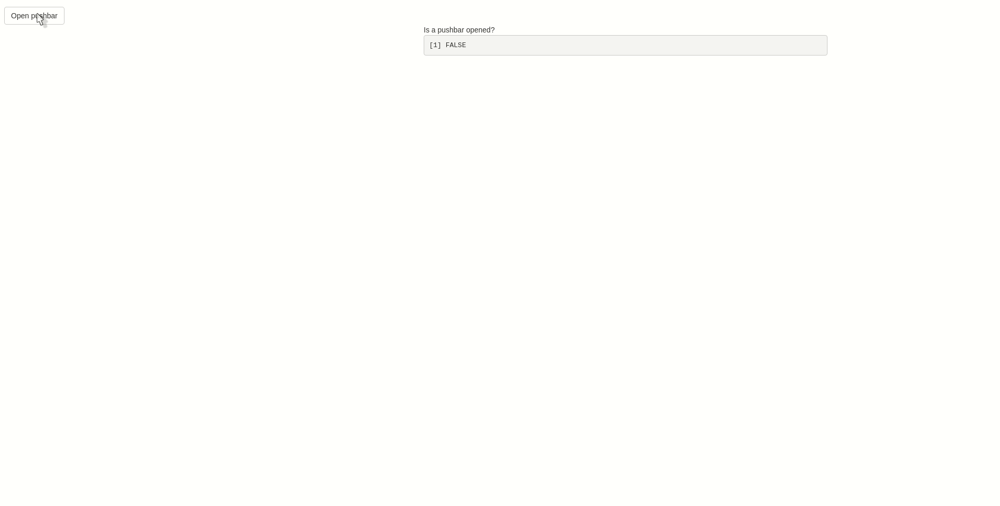

[](https://travis-ci.org/JohnCoene/pushbar)

# pushbar

Brings [pushbar.js](https://oncebot.github.io/pushbar.js/) to Shiny.



## Installation

Install with `remotes`

``` r
# install.packages("remotes")
remotes::install_github("JohnCoene/pushbar")
```

## Update 

In version `0.1.0` and up there is no need to explicitely pass session to various functions, see example.

## How to use

1. Include `pushbar_deps` anywhere in your ui.
2. Include `setup_pushbar` at the top of your server function.
3. Use `pushbar` to include content in pushbars. 
4. Use `pushbar_open` and `pushbar_close` to programatically open and close the pushbars.

Also includes an event (see example) to capture whether a pushbar is opened.

## Example

### [Demo](https://shiny.john-coene.com/pushbar)

``` r
library(shiny)
library(pushbar)

ui <- fluidPage(
   pushbar_deps(),
	 br(),
   actionButton("open", "Open pushbar"),
   pushbar(
     h4("HELLO"),
     id = "myPushbar", # add id to get event
     actionButton("close", "Close pushbar")
   ),
   fluidRow(
     column(5),
     column(5, span("Is a pushbar opened?"), verbatimTextOutput("ev"))
   )
 )
 
 server <- function(input, output, session){

   setup_pushbar() # setup

   observeEvent(input$open, {
     pushbar_open(id = "myPushbar")
   })  

   observeEvent(input$close, {
     pushbar_close()
   })  

   output$ev <- renderPrint({
     input$myPushbar_pushbar_opened
   })
 }
 
 if(interactive()) shinyApp(ui, server)
```

